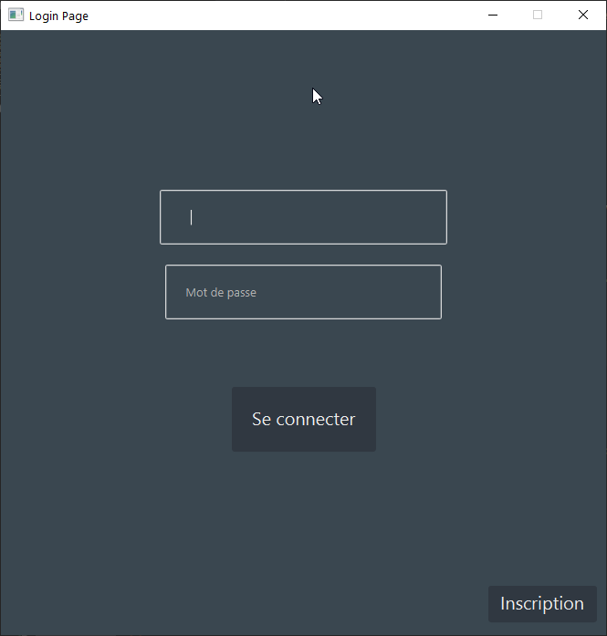
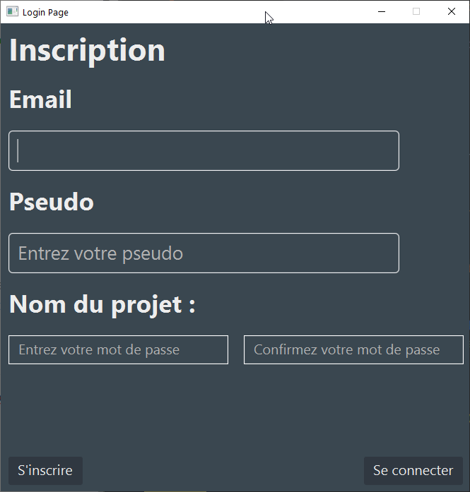
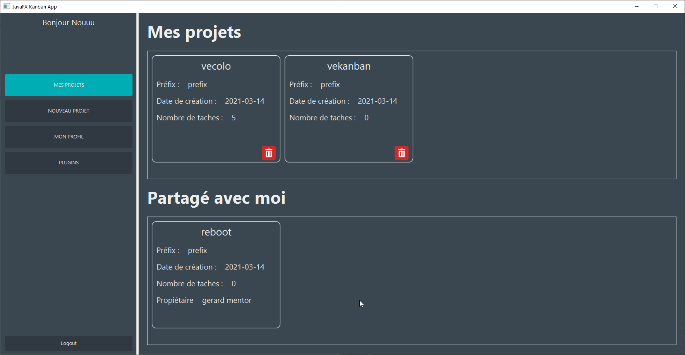
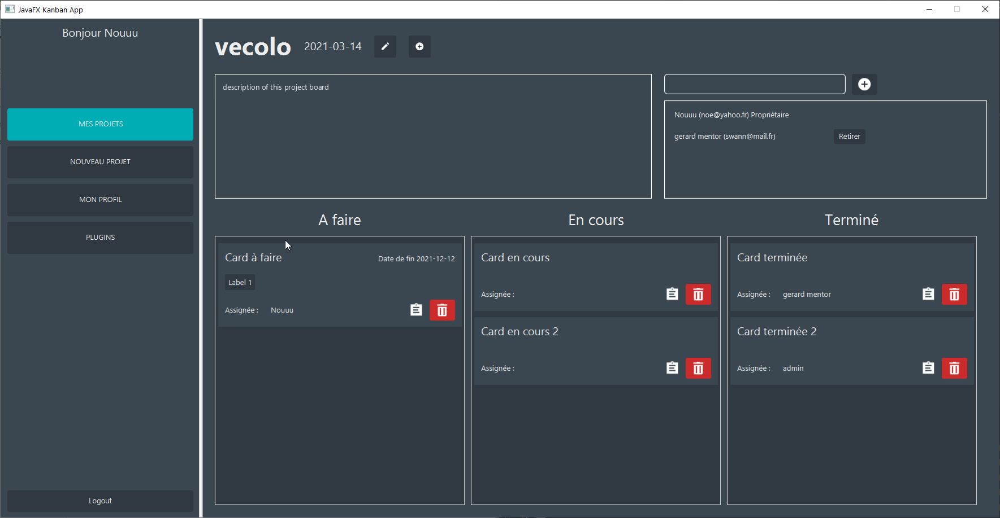
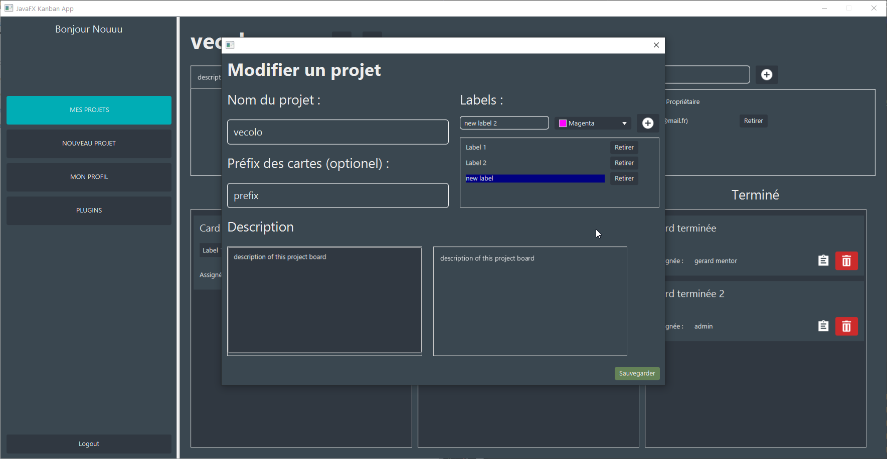
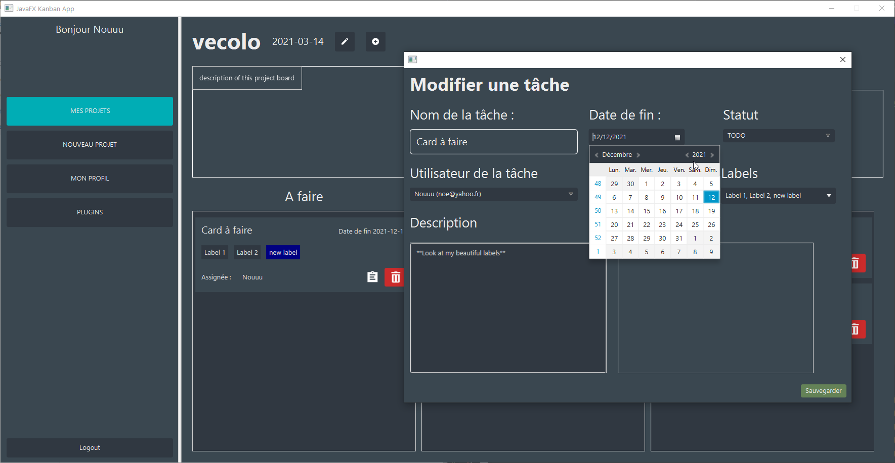
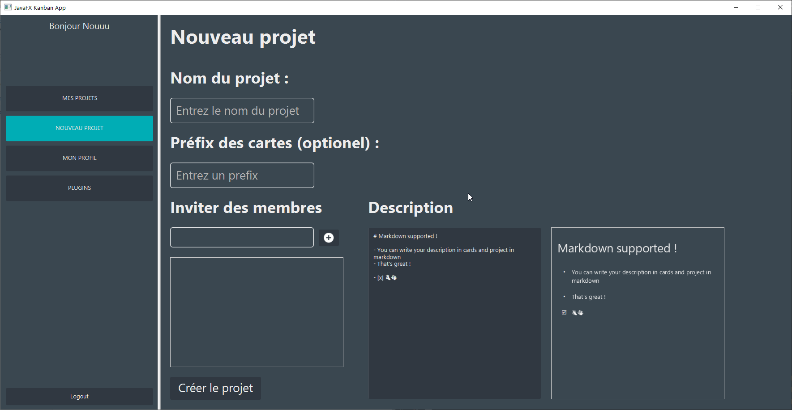
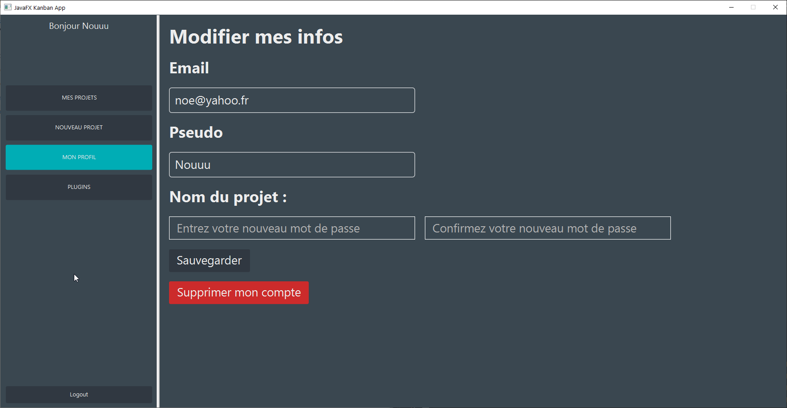
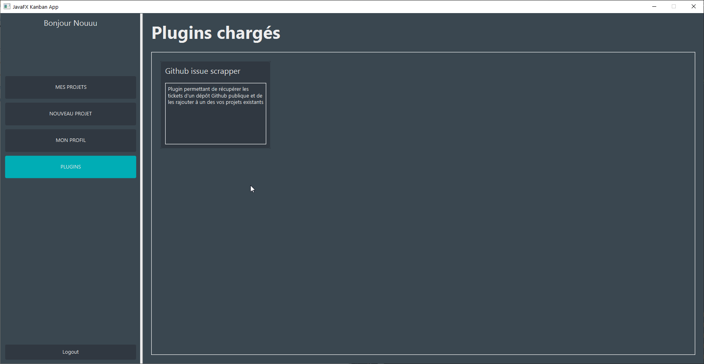
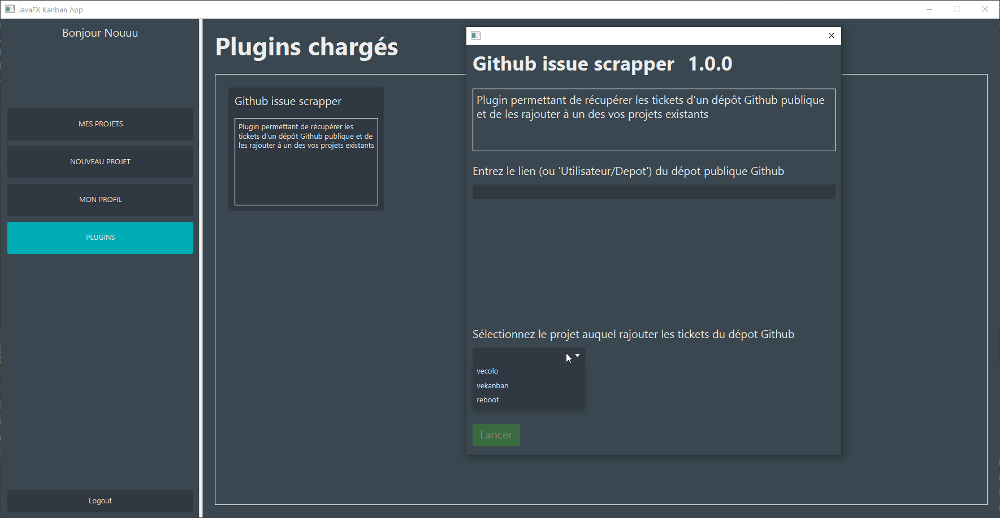

# Vekanban

<!-- toc -->

- [Installation](#installation)
  * [Build from maven](#build-from-maven)
  * [From release](#from-release)
  * [Fill application.properties config file](#fill-applicationproperties-config-file)
  * [Plugins](#plugins)
- [Screenshots](#screenshots)
  * [Login / Signup](#login--signup)
  * [Project list view](#project-list-view)
  * [Project view / edit](#project-view--edit)
  * [New project](#new-project)
  * [Update user profil](#update-user-profil)
  * [Plugin view](#plugin-view)

<!-- tocstop -->

# Installation

## Build from maven

This project have maven parent `pom.xml`.

You just need to run `mvn package` to generate both **Vekanban App** and **Github plugin**.

- Vekanban app jar file is located at `app/target/app-version.jar`

- Github plugin is located at `plugin_1/target/github_plugin-version.jar`

## From release

Or just simply download the latest release at  https://github.com/vecolo-project/vekanban/releases

## Fill application.properties config file

In order to run Vekanban, you need to create the file `application.properties` at the root of your **jar** file. It must look like this :

```properties
# Disable server listening
spring.main.web-application-type=none
# Database config
spring.jpa.hibernate.ddl-auto=create
spring.datasource.initialization-mode=always
spring.datasource.url=jdbc:mariadb://<dbhost>:<dbport>/<dbname>
spring.datasource.username=<username>
spring.datasource.password=<password>
spring.datasource.driver-class-name=org.mariadb.jdbc.Driver
# Some custom config
spring.application.ui.title=JavaFX Kanban App
spring.application.ui.width=1600
spring.application.ui.height=800
spring.application.login.title=Login Page
spring.application.login.width=600
spring.application.login.height=600
```

>  :warning:
>
> `spring.jpa.hibernate.ddl-auto=create` should be set at `create` at first launch to create your DB Schema if it is empty, then you should set it at `none` to avoid your DB to be erased.

## Plugins

Plugin API is provided at `plugin_api` module, you can use it like Github Plugin demo to create your own plugin for Vekanban.

Then just them (jar file) in `plugins` folder at the root of the App.

# Screenshots

## Login / Signup

|  |  |
| :----------------------------------------------------------: | :----------------------------------------------------------: |

## Project list view



## Project view / edit

|  |  |
| ------------------------------------------------------------ | ------------------------------------------------------------ |



## New project



## Update user profil



## Plugin view

|  |  |
| ------------------------------------------------------------ | ------------------------------------------------------------ |


